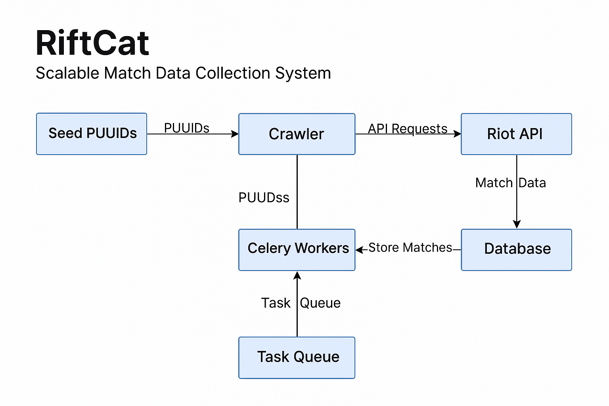

### 🧠 Project: **RiftCat**

**RiftCat** is a next-generation, scalable infrastructure engineered for the intelligent and large-scale acquisition of *League of Legends* match data, leveraging Riot’s official API. Designed for autonomous, viral, and distributed operation, RiftCat systematically explores the summoner ecosystem, expanding from initial seed nodes.

---

### 🎯 Project Objectives

- Develop a **smart viral crawler** that systematically expands across interconnected player profiles.
- Construct a **persistent, dynamic summoner graph** capable of continuous evolution.
- Capture, filter, and store high-value data on matches and players.
- Integrate RiftCat as a core module within a future, advanced *AI-powered coaching* platform for LoL.

---

### ⚙️ Technology Stack

- **Programming Language**: Python
- **API Integration**: Riot Games Developer API
- **Web Framework**: FastAPI
- **Database**: PostgreSQL
- **ORM**: SQLAlchemy
- **Task Management**: Celery + Redis
- **Distributed Crawling**: Viral routing via custom crawler algorithms
- **Infrastructure**: Docker and docker-compose

---

### 📁 Project Structure

```bash
RiftCat/
│
├── app/
│   ├── core/           # Configuration, logging, and API access
│   ├── crawler/        # Viral exploration algorithms, graph growth
│   ├── workers/        # Asynchronous match retrieval tasks
│   ├── db/             # ORM models and database management
│   └── api/            # FastAPI endpoints for external access
│
├── scripts/            # Utilities and testing tools
├── data/               # Collected match JSON, logs, and metadata
├── tests/              # Automated testing suite
│
├── .env                # Environment variables and secure credentials
├── requirements.txt    # Dependency management
├── Dockerfile
├── docker-compose.yml
└── README.md
```
📄 [View System Architecture](docs/README_ARCHITECTURE.md)



---

### 🧩 Key Features

- **Autonomous Viral Crawling**: Continuously discovers new player profiles through match network traversal.
- **Selective Expansion**: Applies intelligent filters to prioritize high-quality, strategic data.
- **Modular and Scalable**: Every component (crawler, workers, persistence, API) is independently scalable for maximum flexibility.
- **Built for Growth**: Optimized for distributed deployment and continuous, high-volume data operations.
