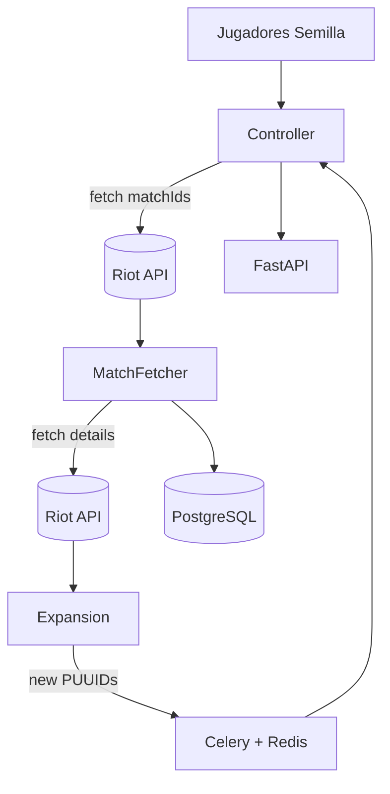

# 🧠 RiftCat – Arquitectura del Sistema

---

## 📌 Componentes Principales

### 1. `Seed Initialization`
Se define una lista inicial de `PUUIDs` (jugadores semilla). Estas identidades son utilizadas para comenzar el proceso de recolección.

### 2. `Crawler Controller`
El controlador principal recibe los `PUUIDs` y ejecuta tareas de búsqueda de partidas recientes a través de la Riot API (`/match/v5/matches/by-puuid/{puuid}/ids`).

### 3. `Match Fetcher`
Por cada ID de partida, se descargan los detalles completos (`/match/v5/matches/{matchId}`), incluyendo todos los participantes.

### 4. `Graph Expansion Engine`
Se extraen nuevos `PUUIDs` desde las partidas. Aquellos que aún no han sido explorados se agregan a la cola para ser procesados.

### 5. `Task Queue (Celery + Redis)`
Cada nodo (PUUID) nuevo es enviado como tarea asincrónica. Esto permite una expansión viral y distribuida del crawler.

### 6. `Storage Layer`
Los datos de partidas y jugadores se almacenan en PostgreSQL utilizando modelos definidos con SQLAlchemy. Las tablas incluyen:
- Jugadores (PUUIDs)
- Partidas (matchId, metadatos)
- Relaciones jugador-partida

### 7. `API Layer (FastAPI)`
Exposición de endpoints para monitorear el sistema, consultar datos recolectados o forzar nuevas expansiones.

---

## 🔁 Flujo de Datos

---

## ♻️ Escalabilidad y Control
- El sistema incluye límites por región y manejo de rate limiting de Riot.
- Se utiliza un sistema de cache/localización para evitar procesar el mismo jugador dos veces.
- El diseño modular permite escalar los workers horizontalmente.

---

## 🚀 Futuro
Este módulo será el núcleo de recolección para una plataforma de análisis tipo *coach IA*, integrando aprendizaje automático para seleccionar partidas de mayor valor estratégico.

---

> Última actualización: Abril 2025

